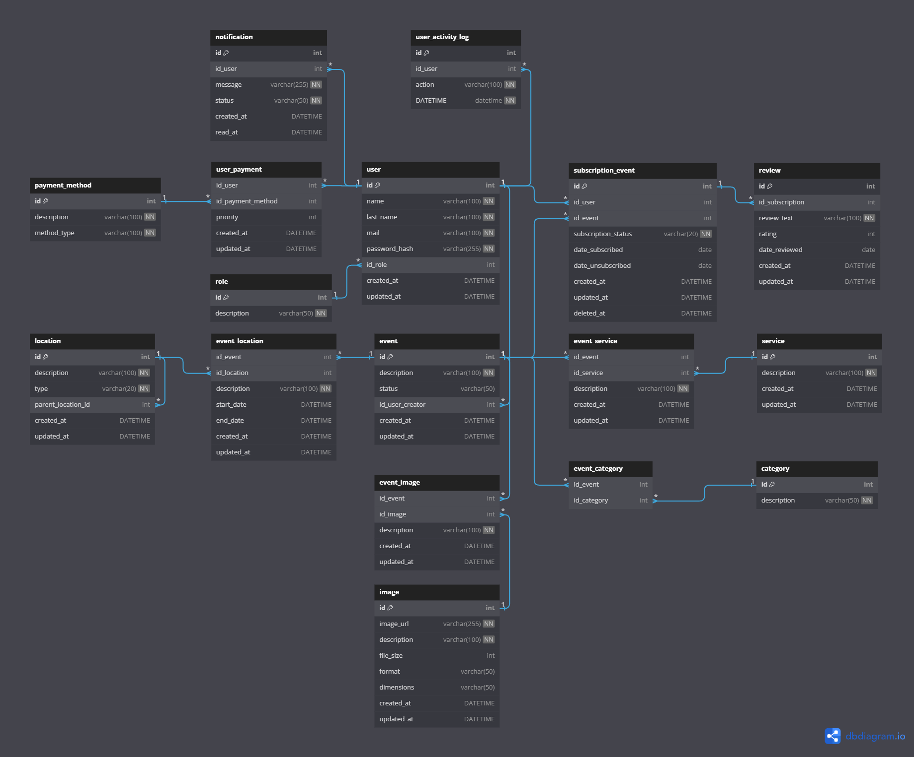

# Voyage

**How to wake up the project?**

    uvicorn main:app --host 0.0.0.0 --port 3001 --reload

**To use Alembic, do**

    -> use to migrate orm changes in backend to database <-
    alembic init migrations -> only once
    alembic revision --autogenerate -m "First Migration"
    alembic upgrade head

**Entity Relationship Diagram**

